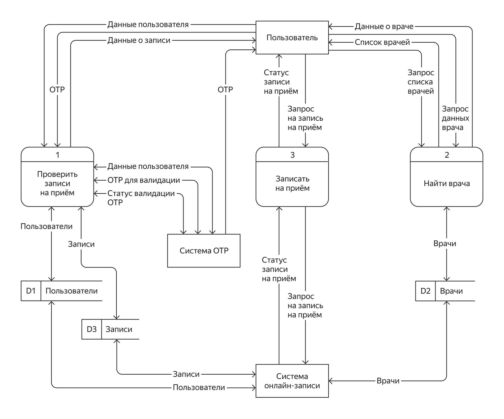
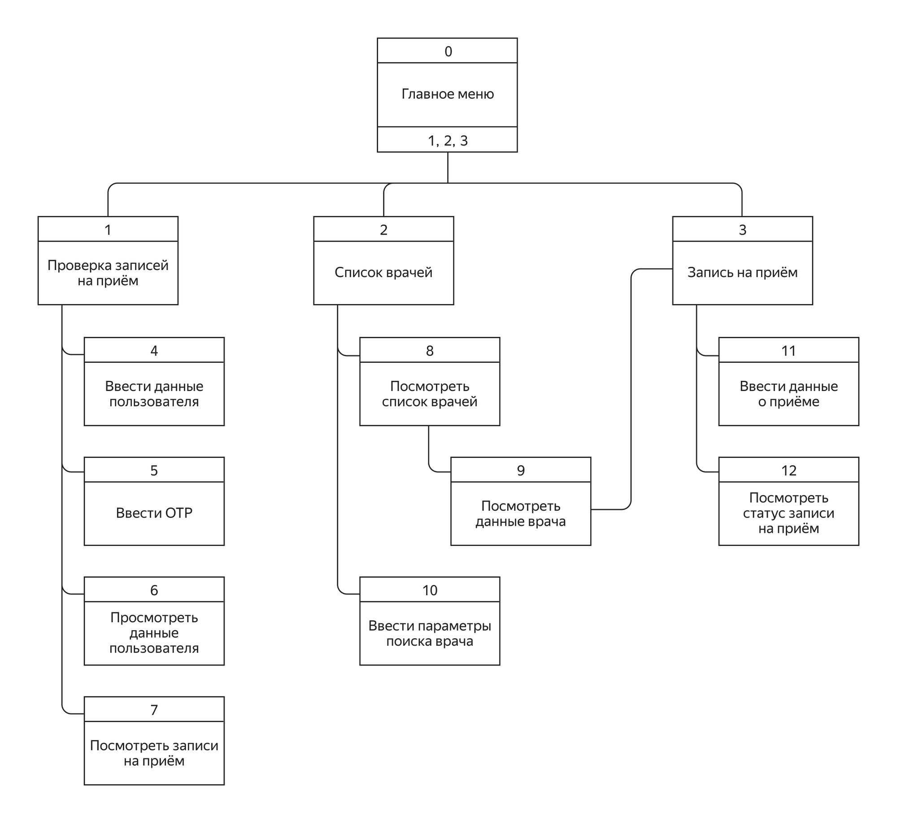
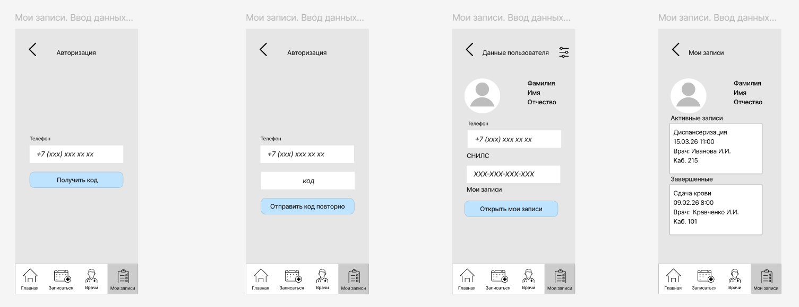
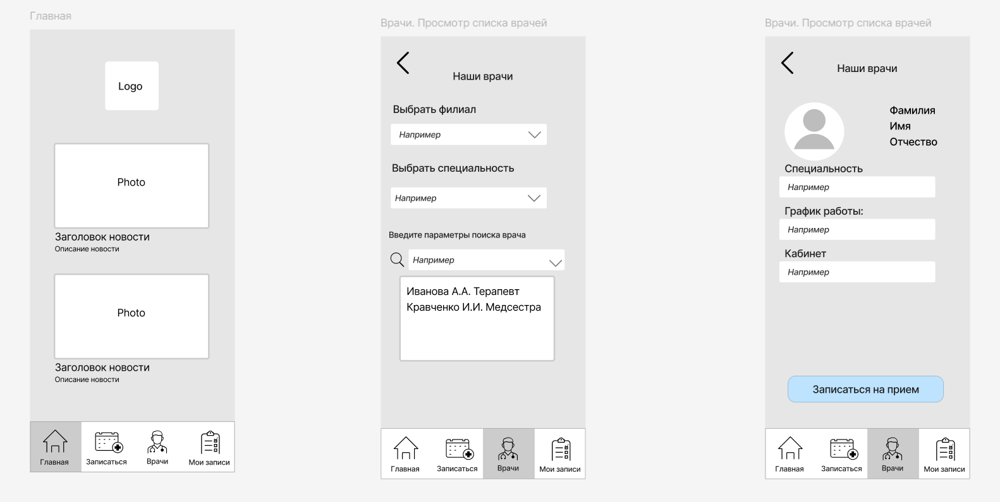
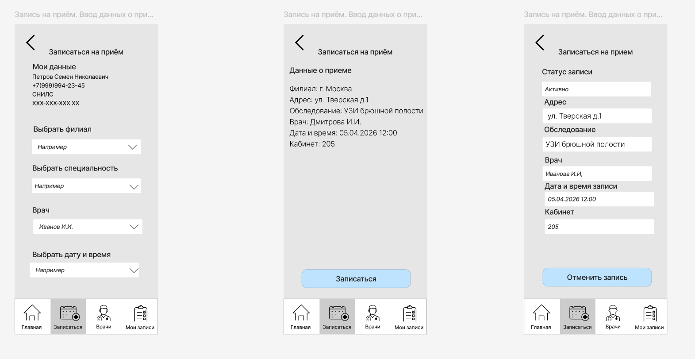

# Проектирование Storyboard мобильного приложения для сети медицинских клиник

## О проекте

Цель проекта — разработать раскадровку (Storyboard) мобильного приложения для сети медицинских клиник на основе готовых аналитических артефактов.

В рамках проекта необходимо было преобразовать функциональные требования, диаграммы потоков данных (DFD) и структуру интерфейса в последовательность экранов, отражающих реальные пользовательские сценарии взаимодействия с системой.

Основными возможностями приложения являются:

- просмотр списка врачей;
- поиск врача по заданным параметрам;
- просмотр информации о специалисте;
- запись на прием;
- просмотр и управление своими записями.

---

# Моя роль — Системный аналитик

В рамках проекта я выполнял следующие задачи:

- анализ функциональных требований приложения;
- анализ DFD-диаграмм и структуры пользовательского интерфейса;
- определение пользовательских сценариев;
- проектирование навигации между экранами;
- разработка storyboard пользовательских сценариев;
- создание низкоуровневых wireframe-прототипов экранов;
- проверка полноты пользовательских сценариев относительно требований.

---

# Постановка задачи

При проектировании интерфейса необходимо было обеспечить возможность:

- авторизации пользователя по номеру телефона с использованием OTP-кода;
- просмотра списка врачей;
- поиска врачей по филиалу, специальности и дополнительным параметрам;
- просмотра подробной информации о враче;
- записи на прием;
- просмотра текущих и завершенных записей на прием.

---

# Артефакты проекта

## DFD-диаграмма

На основании требований была проанализирована диаграмма потоков данных, описывающая взаимодействие пользователя с системой онлайн-записи, сервисом OTP и базой данных врачей.

  

---

## Диаграмма структуры интерфейса

Для определения навигации приложения была использована диаграмма структуры интерфейса, отражающая взаимосвязь экранов и пользовательских сценариев.

  

---

## Storyboard. Авторизация и мои записи

Разработана последовательность экранов для авторизации пользователя по OTP-коду, просмотра личных данных и списка активных и завершенных записей.

  

---

## Storyboard. Поиск и просмотр врачей

Спроектирован пользовательский сценарий поиска врача с использованием фильтрации по филиалу, специальности и параметрам поиска, а также экран просмотра подробной информации о специалисте.

  

---

## Storyboard. Запись на прием

Разработан сценарий записи пользователя на прием, включающий выбор параметров приема, подтверждение записи и просмотр информации о созданной записи.

  

---

# Используемые инструменты

- **Figma** — разработка wireframe-прототипов;
- **draw.io (diagrams.net)** — анализ DFD и структуры интерфейса;
- Storyboarding;
- User Flow Analysis.

---

# Результат проекта

В результате проекта был подготовлен комплект артефактов, позволяющий команде разработки реализовать пользовательский интерфейс мобильного приложения:

- анализ диаграммы потоков данных (DFD);
- анализ структуры интерфейса;
- storyboard основных пользовательских сценариев;
- wireframe-прототипы экранов мобильного приложения;
- описание навигации между экранами;
- пользовательские сценарии для процессов авторизации, поиска врача, записи на прием и просмотра личных записей.

Подготовленные материалы могут использоваться в качестве основы для последующего UI-дизайна, разработки мобильного приложения и проведения пользовательского тестирования.
